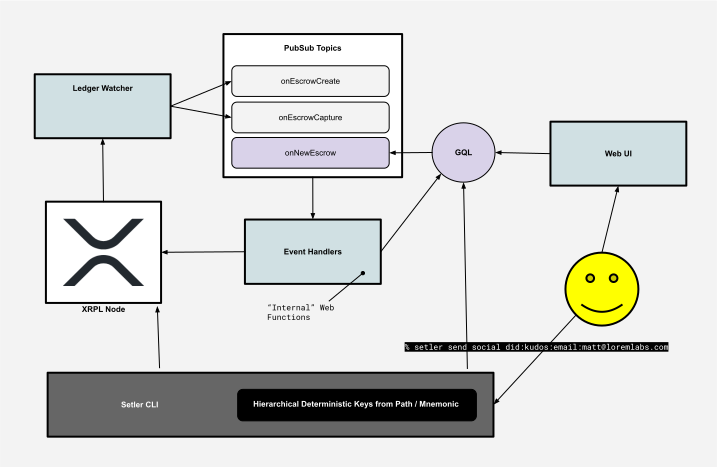

# Setler CLI

Identity Wallet command line interface. 

Use Social Media usernames to send money and perform other Kudos actions.

## Overview

The Setler Identity Wallet is a non-custodial wallet that allows users to send and receive payments on the XRPL. It also allows users to associate their XRPL account with a DID (Decentralized Identifier) which can be used to send and receive payments.

Setler is part of the Kudos ecosystem which rewards content creators.

## Overview Architecture




## Installation

### Install from source

```bash
git clone
cd setler-cli
npm install
npm run build
npm link
```

### Install from npm

```bash
npm install -g setler-cli
```

## Usage

```bash
$ setler send social did:kudos:email:matt@loremlabs.com ...
```

## What happens after sending

1. The escrowed payment is received by the XRPL.
2. The watcher service watches our payment address for new transactions.
3. When we receive a transaction, we check to see if it is an identifier (DID) we know about. If it is, we check to see if the DID has a payment address associated with it.
4. If the DID has a payment address in our database, we fulfill the escrowed payment with the pre-image (previously stored). We then send the funds to the DID's payment address after deducting a fee.
5. If the DID does not have a payment address in our database, the funds can be returned when the escrow expires.

