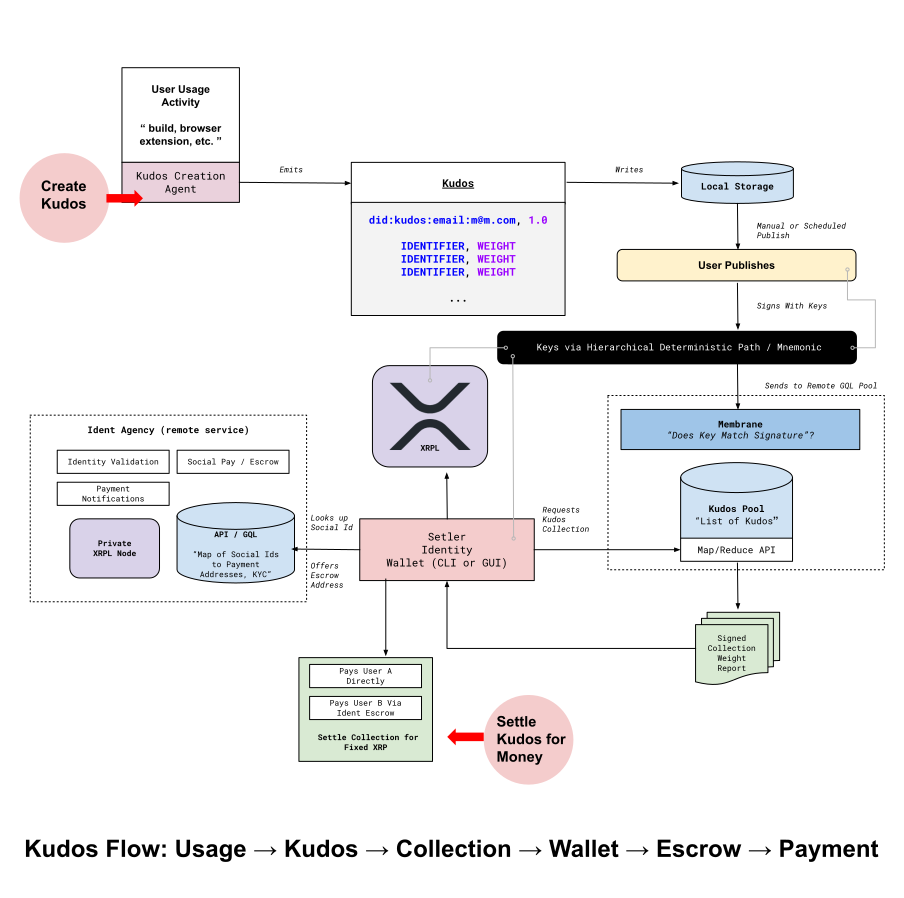

# Kudos for Content

Kudos for Content is a suite of tools that allows users to send Kudos to content creators. It is part of an initiative to reward creators for their work which includes [Kudos for Code](https://github.com/LoremLabs/kudos-for-code) and the [Setler Identity Wallet](https://github.com/LoremLabs/setler).

For content creators who want to be rewarded for their work, `Kudos for Content` is a combination browser extension and non-custodial wallet that privately records the identities of content creators that a user encounters. Unlike existing solutions that require users to manually tip, to have pre-registered, or which require real-time interactions, Kudos automatically supports and pays users from a fixed-budget using the escrow functionality of the XRPL on a batched (monthly) basis.

## Services

`Kudos for Content` is composed of several services:

- `graph` - Example backend GraphQL and API services

## CLI

- `Setler Cli` - Basic CLI tool for interacting with the Setler Identity Wallet

## Overview Architecture

