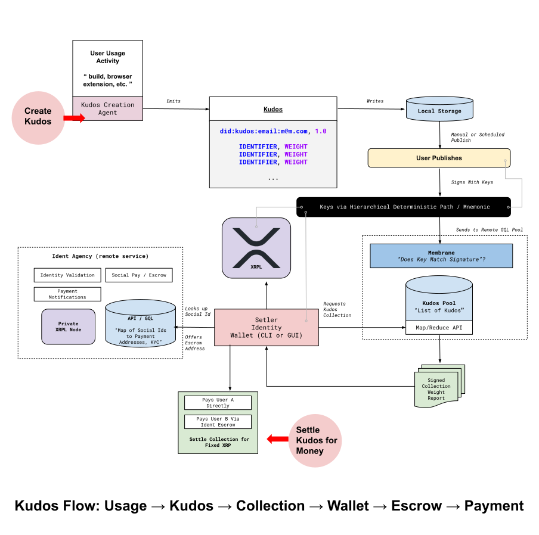

# Kudos

`Kudos` is a new way for rewarding creation while keeping the best parts of the "free Internet". End users (optionally) fund their accounts with a monthly fee which will be proportionally distributed to all kudos they generate for that month.

At its core, Kudos is two steps:

1. Recording the identifiers of those that help you.
2. Splitting a monthly budget between those identifiers.

Kudos is made possible because of a few key technologies:

- [XRPL](https://xrpl.org/) - The XRPL is a decentralized, open-source, and permissionless ledger that allows for fast, cheap, and secure transactions. Crucially, XRPL makes [micropayments](https://xrpl.org/currency-formats.html#xrp-amounts) and [escrow](https://xrpl.org/escrow.html) possible.
- [Hierarchical Deterministic Wallets (HD Wallet)](https://github.com/bitcoin/bips/blob/master/bip-0032.mediawiki) - HD Wallets allow for the creation of multiple accounts from a single seed. This allows for the creation of multiple accounts without the need to store multiple seeds.
- [Decentralized Identifiers (DIDs)](https://www.w3.org/TR/did-core/) - A DID is a decentralized identifier that can be used to identify a person, organization, or thing. It is used to associate a payment address with a person or organization.
- [Verifiable Credentials](https://www.w3.org/TR/vc-data-model/) - Verifiable Credentials are a way to associate a DID with a payment address. They are signed by a trusted party (such as a bank) and can be verified by anyone.

## Repo Structure

This repo contains several sub-components of the reference implementation of Kudos:

- `kudos-for-code` - A reference implementation of Kudos to support open source code contributions
- `kudos-for-content` - A reference implementation of Kudos to support content creators
- `identity-wallet` - Examples of `identity wallets` that allows users to send and receive payments but also manager their Identities, and of course settle Kudos.
- `rfcs` - A collection of RFCs that describe the Kudos protocol and its components.

## Overview Architecture

